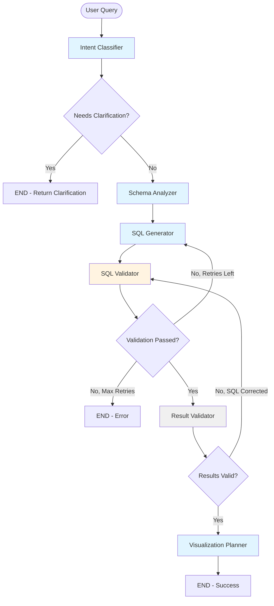

# Agent Implementation Documentation

## Table of Contents
1. [Architecture Overview](#architecture-overview)
2. [Agent Workflow](#agent-workflow)
3. [LLM Calls & Configuration](#llm-calls--configuration)
4. [Latency Analysis](#latency-analysis)
5. [Performance Characteristics](#performance-characteristics)
6. [State Management](#state-management)
7. [Error Handling & Retries](#error-handling--retries)

---

## Architecture Overview

The restaurant analytics agent uses a **LangGraph-based multi-agent system** to convert natural language queries into SQL, execute them, and generate visualizations.

### Technology Stack
- **Framework**: LangGraph (StateGraph)
- **LLM Provider**: NVIDIA AI Endpoints
- **Model**: `ai-nemotron-3-nano-30b-a3b` (primary), same for fast operations
- **Database**: PostgreSQL (Supabase)
- **Language**: Python 3.11+

### High-Level Flow

```
User Query → API Endpoint → Agent Runner → LangGraph Workflow → SQL Execution → Response
```

---

## Agent Workflow

### Workflow Graph



### Agent Sequence

1. **Intent Classifier** → Classifies query intent and extracts entities
2. **Schema Analyzer** → Determines required tables, columns, and joins
3. **SQL Generator** → Generates PostgreSQL query
4. **SQL Validator** → Validates SQL safety and correctness (rule-based)
5. **Result Validator** → Pass-through (SQL execution in main.py)
6. **Visualization Planner** → Selects chart type and configuration
7. **Answer Generator** → Generates natural language answer (post-execution)

---

## LLM Calls & Configuration

### 1. Intent Classifier Agent

**File**: `backend/agents/intent_classifier.py`

**Purpose**: Analyze user query to extract intent, entities, and time range.

**LLM Configuration**:
```python
ChatNVIDIA(
    model="ai-nemotron-3-nano-30b-a3b",
    temperature=0.1,        # Low for consistent classification
    top_p=1,
    max_tokens=1024,
    reasoning_budget=1024,
    chat_template_kwargs={"enable_thinking": True}
)
```

**Prompt Inputs**:
- `user_query`: Natural language query
- `entity_mappings`: Schema entity mappings (JSON)
- `conversation_history`: Last 3 messages (formatted as string)

**Output**:
- `query_intent`: Intent enum (sales_analysis, product_analysis, etc.)
- `intent_confidence`: 0.0-1.0
- `entities_extracted`: Locations, products, categories, etc.
- `time_range`: Start/end dates or relative time
- `needs_clarification`: Boolean flag

**Estimated Latency**: 3-8 seconds (based on logs)

---

### 2. Schema Analyzer Agent

**File**: `backend/agents/schema_analyzer.py`

**Purpose**: Determine which tables, columns, and joins are needed.

**LLM Configuration**:
```python
ChatNVIDIA(
    model="ai-nemotron-3-nano-30b-a3b",
    temperature=0.1,
    top_p=1,
    max_tokens=512,         # Reduced - schema response is small JSON
)
```

**Prompt Inputs**:
- `user_query`: Original query
- `schema_summary`: Complete schema information
- `intent`: Classified intent
- `entities`: Extracted entities (JSON)
- `time_range`: Time constraints (JSON)

**Output**:
- `relevant_tables`: List of table/view names
- `relevant_columns`: Dict mapping table → columns
- `required_joins`: List of join information
- `schema_considerations`: Special notes (e.g., "divide by 100")
- `use_views`: Boolean (use pre-aggregated views vs base tables)

**Fallback**: Heuristic-based analysis if LLM fails

**Estimated Latency**: 4-6 seconds

---

### 3. SQL Generator Agent

**File**: `backend/agents/sql_generator.py`

**Purpose**: Generate PostgreSQL query from schema analysis.

**LLM Configuration**:
```python
ChatNVIDIA(
    model="ai-nemotron-3-nano-30b-a3b",
    temperature=0.2,        # Slightly higher for creativity
    top_p=1,
    max_tokens=1024,
    reasoning_budget=1024,
    chat_template_kwargs={"enable_thinking": True}
)
```

**Prompt Inputs**:
- `user_query`: Original query
- `intent`: Query intent
- `entities`: Extracted entities
- `time_range`: Time constraints
- `tables`: Selected tables/views
- `columns`: Column mappings
- `joins`: Join requirements
- `considerations`: Schema notes
- `time_expressions`: Time mapping rules
- **Retry Context**: Previous errors and failed SQL (if retrying)

**Output**:
- `generated_sql`: PostgreSQL query string
- `explanation`: Brief description
- `expected_columns`: Expected result columns

**Retry Logic**: Includes previous errors in prompt on retry

**Estimated Latency**: 3-6 seconds (longer on retries)

---

### 4. SQL Validator Agent

**File**: `backend/agents/sql_validator.py`

**Purpose**: Validate SQL for safety and correctness.

**LLM Calls**: **NONE** - Rule-based validation

**Validation Rules**:
- Only SELECT statements allowed
- Proper cents-to-dollars conversion
- Voided orders filter (unified_orders.voided = FALSE)
- SQL injection patterns
- Context-aware checks (tables match, date filters present, etc.)

**Output**:
- `sql_validation_passed`: Boolean
- `sql_errors`: List of errors
- `sql_warnings`: List of warnings

**Estimated Latency**: < 100ms (rule-based, very fast)

---

### 5. Result Validator Agent

**File**: `backend/agents/result_validator.py`

**Purpose**: Pass-through agent (SQL execution happens in main.py).

**LLM Calls**: **NONE**

**Note**: SQL execution is async and happens outside the LangGraph workflow to avoid event loop conflicts.

**Estimated Latency**: < 10ms (just state update)

---

### 6. Visualization Planner Agent

**File**: `backend/agents/viz_planner.py`

**Purpose**: Select appropriate chart type and configuration.

**LLM Configuration**:
```python
ChatNVIDIA(
    model="ai-nemotron-3-nano-30b-a3b",  # Same model (no fast model configured)
    temperature=0.1,
    top_p=1,
    max_tokens=512,
)
```

**Prompt Inputs**:
- `user_query`: Original query
- `intent`: Query intent
- `sql`: Generated SQL
- `columns`: Result columns
- `result_count`: Number of result rows

**Output**:
- `visualization_type`: Chart type enum
- `visualization_config`: Chart configuration (axes, title, format, etc.)

**Fallback**: Heuristic-based selection if LLM fails

**Estimated Latency**: 2-4 seconds

**Note**: Called twice:
1. In LangGraph workflow (before results)
2. In main.py post-execution (with actual results) - this is the one used

---

### 7. Answer Generator Agent

**File**: `backend/agents/answer_generator.py`

**Purpose**: Generate natural language answer from query results.

**LLM Configuration**:
```python
ChatNVIDIA(
    model="ai-nemotron-3-nano-30b-a3b",
    temperature=0.3,        # Higher for more natural language
    top_p=1,
    max_tokens=1024,
    reasoning_budget=1024,
    chat_template_kwargs={"enable_thinking": True}
)
```

**Prompt Inputs**:
- `user_query`: Original question
- `sql`: Generated SQL
- `results_sample`: First 20 rows (JSON)
- `result_count`: Total number of results
- `columns`: Column names

**Output**:
- `generated_answer`: Natural language answer (2-4 sentences)
- `key_insights`: List of insights

**Fallback**: Simple template-based answer if LLM fails

**Estimated Latency**: 2-5 seconds

**Note**: Called in main.py after SQL execution (not in LangGraph workflow)

---

## Latency Analysis

### Total Latency Breakdown

Based on code analysis and typical LLM response times:

| Component | Type | Estimated Time | Notes |
|-----------|------|----------------|-------|
| **Intent Classifier** | LLM | 3-8s | First LLM call, includes thinking time |
| **Schema Analyzer** | LLM | 4-6s | Medium complexity prompt |
| **SQL Generator** | LLM | 3-6s | Can be longer on retries (up to 2 retries) |
| **SQL Validator** | Rules | < 100ms | Rule-based, very fast |
| **Result Validator** | Pass-through | < 10ms | Just state update |
| **Visualization Planner** | LLM | 2-4s | Simpler task, faster |
| **SQL Execution** | Database | 100-500ms | Depends on query complexity |
| **Answer Generator** | LLM | 2-5s | Post-execution |
| **Other Processing** | Code | 50-200ms | State management, formatting |

### Sequential vs Parallel Execution

**Current Implementation**: **Sequential** (one agent at a time)

- Agents execute in sequence through LangGraph workflow
- Each LLM call waits for previous to complete
- Total time = Sum of all agent times

**Typical Query Timeline**:

```
0s     → Intent Classifier starts
3-8s   → Schema Analyzer starts
7-14s  → SQL Generator starts
10-20s → SQL Validator (fast)
10-20s → Result Validator (pass-through)
12-24s → Visualization Planner starts
14-28s → LangGraph workflow completes
14-28s → SQL Execution (async in main.py)
14-28s → Answer Generator starts
16-33s → Total response time
```

### Retry Impact on Latency

**SQL Generation Retries**:
- Max retries: 2
- Each retry adds: 3-6 seconds
- Worst case: +12 seconds (2 retries × 6s)

**SQL Execution Retries** (in main.py):
- Max retries: 2
- Each retry restarts entire workflow
- Worst case: +30-60 seconds (full workflow restart)

**Example from Logs**:
```
Attempt 1: 13.86s (failed SQL execution)
Attempt 2: 19.86s (failed SQL execution)
Attempt 3: 12.82s (failed SQL execution)
Total: ~46.5 seconds
```

### Latency Optimization Opportunities

1. **Parallel LLM Calls**: Some agents could run in parallel
   - Schema Analyzer and Intent Classifier outputs are independent
   - Visualization Planner could start before SQL execution

2. **Caching**: 
   - Cache schema analysis for similar queries
   - Cache intent classification for common patterns

3. **Model Selection**:
   - Use faster model for simpler tasks (viz planning already does this)
   - Consider smaller models for classification tasks

4. **Prompt Optimization**:
   - Reduce token counts where possible
   - Use more structured prompts to reduce thinking time

5. **Early Exit**:
   - Skip visualization planning if results are empty
   - Skip answer generation for simple queries

---

## Performance Characteristics

### Throughput

- **Sequential Processing**: 1 query at a time per instance
- **Concurrent Requests**: Limited by database connection pool (max 20)
- **Bottleneck**: LLM API rate limits and response times

### Resource Usage

- **Memory**: Moderate (LangGraph state, query results)
- **CPU**: Low (mostly I/O bound waiting for LLM/DB)
- **Database Connections**: Pooled (5-20 connections)

### Scalability

- **Horizontal**: Can scale by adding more API instances
- **Vertical**: Limited by LLM API rate limits
- **Database**: Connection pool limits concurrent queries

### Error Rates

- **LLM Parsing Errors**: ~5-10% (handled with fallbacks)
- **SQL Execution Errors**: ~10-20% (trigger retries)
- **Validation Failures**: ~15-25% (trigger SQL regeneration)

---

## State Management

### AgentState Structure

The `AgentState` TypedDict is passed through all agents:

```python
{
    # Input
    "user_query": str,
    "conversation_history": list[dict[str, str]],
    
    # Intent Classification
    "query_intent": QueryIntent,
    "intent_confidence": float,
    "entities_extracted": ExtractedEntities,
    "time_range": TimeRange,
    
    # Schema Analysis
    "relevant_tables": list[str],
    "relevant_columns": dict[str, list[str]],
    "required_joins": list[JoinInfo],
    "schema_considerations": list[str],
    "use_views": bool,
    
    # SQL Generation
    "generated_sql": str,
    "sql_explanation": str,
    "expected_columns": list[str],
    
    # SQL Validation
    "sql_validation_passed": bool,
    "sql_errors": list[str],
    "sql_warnings": list[str],
    
    # Execution
    "query_results": list[dict[str, Any]],
    "result_count": int,
    "execution_time_ms": float,
    "execution_error": str | None,
    
    # Result Validation
    "results_valid": bool,
    "result_validation_issue": str,
    "sql_corrected": bool,
    
    # Visualization
    "visualization_type": VisualizationType,
    "visualization_config": VisualizationConfig,
    "chart_config": dict[str, Any],
    
    # Answer Generation
    "generated_answer": str,
    "key_insights": list[str],
    
    # Control Flow
    "needs_clarification": bool,
    "clarification_question": str,
    "retry_count": int,
    "max_retries": int,
    "result_retry_count": int,
    
    # Metadata
    "processing_start_time": float,
    "total_processing_time_ms": float,
    "agent_trace": list[str],
}
```

### State Updates

- Each agent reads from state and updates relevant fields
- State is immutable in LangGraph (agents return updated state)
- `agent_trace` tracks which agents processed the query

---

## Error Handling & Retries

### Retry Mechanisms

1. **SQL Generation Retries**:
   - Triggered by: SQL validation failures
   - Max retries: 2
   - Mechanism: Loop back to SQL Generator with error context

2. **SQL Execution Retries**:
   - Triggered by: PostgreSQL errors
   - Max retries: 2
   - Mechanism: Restart entire workflow with error context

3. **Result Validation Retries**:
   - Triggered by: Invalid results (if implemented)
   - Max retries: 1
   - Mechanism: Correct SQL and re-validate

### Fallback Mechanisms

1. **Intent Classifier**: Sets intent to UNKNOWN, requests clarification
2. **Schema Analyzer**: Uses heuristic-based table selection
3. **SQL Generator**: Returns empty SQL, triggers validation error
4. **Visualization Planner**: Uses intent-based heuristics
5. **Answer Generator**: Uses template-based answers

### Error Propagation

- Errors are logged at each agent level
- State includes `execution_error` field
- Final response includes error details if all retries fail

---

## Summary

### Key Metrics

- **Total LLM Calls**: 5-6 per query (depending on retries)
- **Average Latency**: 15-25 seconds (successful queries)
- **Worst Case Latency**: 60+ seconds (with retries)
- **LLM Model**: ai-nemotron-3-nano-30b-a3b (all agents)
- **Max Retries**: 2 per retry type

### Strengths

- ✅ Comprehensive error handling
- ✅ Fallback mechanisms at each stage
- ✅ Detailed state tracking
- ✅ Flexible retry logic

### Areas for Improvement

- ⚠️ Sequential execution (could parallelize some agents)
- ⚠️ No caching of intermediate results
- ⚠️ Long latency for complex queries
- ⚠️ Multiple retries can significantly increase latency

---

## Appendix: Log Analysis Example

From terminal logs, a typical query flow:

```
[query_id] Processing query: How much came from DoorDash?...
Intent classifier processing: How much came from DoorDash?...
Intent classified: source_comparison (confidence: 0.93)
Schema analyzer processing query with intent: QueryIntent.SOURCE_COMPARISON
Schema analysis complete: 0 tables, 0 joins, use_views=True
SQL generator processing...
SQL generated: 87 chars
SQL validator processing...
Validation passed with 2 warnings
Result validator: Pass-through
Visualization planner processing...
Query processed in 13863.05ms. Agents: ['intent_classifier', 'schema_analyzer', 'sql_generator', 'sql_validator', 'result_validator', 'viz_planner']
SQL execution error: column "total_revenue" does not exist
Retrying after SQL error (attempt 2)
[Full workflow restarts...]
Total: ~46.5 seconds with 3 attempts
```

This shows:
- Initial workflow: ~13.9 seconds
- Each retry: ~13-20 seconds
- Total with 3 attempts: ~46.5 seconds


