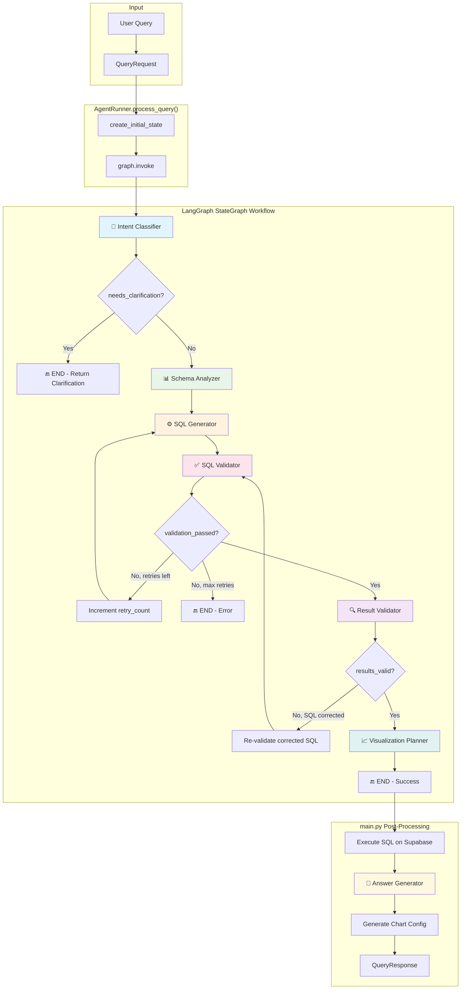

# Restaurant Analytics Agent - Architecture Documentation

## System Overview

This backend implements a **Natural Language to SQL (NL2SQL)** agentic system using LangGraph for orchestration. It converts user questions about restaurant data into SQL queries, executes them, and returns formatted results with visualizations.

---

## High-Level Architecture

```
┌─────────────────────────────────────────────────────────────────────────────────┐
│                              FRONTEND (Next.js)                                  │
│                     User Interface / Query Input / Charts                        │
└─────────────────────────────────────┬───────────────────────────────────────────┘
                                      │ HTTP POST /api/query
                                      ▼
┌─────────────────────────────────────────────────────────────────────────────────┐
│                           FastAPI APPLICATION                                    │
│  ┌────────────────┐  ┌──────────────────┐  ┌────────────────────────────────┐  │
│  │  main.py       │  │  CORS Middleware │  │  Lifespan (startup/shutdown)   │  │
│  │  API Routes    │  │                  │  │  - Init DB Pool                │  │
│  │  - /api/query  │  │                  │  │  - Init Agent Runner           │  │
│  │  - /api/schema │  │                  │  │                                │  │
│  │  - /api/health │  │                  │  │                                │  │
│  └───────┬────────┘  └──────────────────┘  └────────────────────────────────┘  │
└──────────┼──────────────────────────────────────────────────────────────────────┘
           │
           ▼
┌─────────────────────────────────────────────────────────────────────────────────┐
│                        LANGGRAPH AGENT FRAMEWORK                                 │
│                          (agent_framework.py)                                    │
│                                                                                  │
│   ┌─────────────────────────────────────────────────────────────────────────┐   │
│   │                         AgentRunner (Singleton)                          │   │
│   │                                                                          │   │
│   │   process_query(query, context) → AgentState                            │   │
│   │                                                                          │   │
│   └─────────────────────────────────────────────────────────────────────────┘   │
│                                      │                                           │
│                                      ▼                                           │
│   ┌─────────────────────────────────────────────────────────────────────────┐   │
│   │                      StateGraph Workflow                                 │   │
│   │                                                                          │   │
│   │    [START] → Intent → Schema → SQL Gen → SQL Validate → Result → Viz    │   │
│   │               ↓                    ↑          │                          │   │
│   │           [CLARIFY]            [RETRY]    [EXECUTE]                      │   │
│   │              ↓                    ↑          ↓                           │   │
│   │            [END]              (if errors)  [END]                         │   │
│   │                                                                          │   │
│   └─────────────────────────────────────────────────────────────────────────┘   │
│                                                                                  │
└─────────────────────────────────────────────────────────────────────────────────┘
           │
           ▼
┌─────────────────────────────────────────────────────────────────────────────────┐
│                           EXTERNAL SERVICES                                      │
│                                                                                  │
│   ┌─────────────────────────┐         ┌─────────────────────────────────────┐   │
│   │    NVIDIA AI Endpoints  │         │       Supabase PostgreSQL           │   │
│   │    (ChatNVIDIA LLM)     │         │       (asyncpg connection pool)     │   │
│   │                         │         │                                     │   │
│   │  - Intent Classification│         │  Tables:                            │   │
│   │  - Schema Analysis      │         │  - unified_orders                   │   │
│   │  - SQL Generation       │         │  - unified_order_items              │   │
│   │  - Visualization Plan   │         │  - unified_products                 │   │
│   │  - Answer Generation    │         │  - unified_locations                │   │
│   │                         │         │  - unified_payments                 │   │
│   │  Model: nemotron-3-nano │         │                                     │   │
│   └─────────────────────────┘         │  Views (Pre-aggregated):            │   │
│                                       │  - v_daily_sales_summary            │   │
│                                       │  - v_product_sales_summary          │   │
│                                       │  - v_hourly_sales_pattern           │   │
│                                       └─────────────────────────────────────┘   │
│                                                                                  │
└─────────────────────────────────────────────────────────────────────────────────┘
```

---

## LangGraph Agent Flow (Detailed)



---

## Agent Roles & Responsibilities

### 1. 🎯 Intent Classifier Agent

**File:** `agents/intent_classifier.py`

| Aspect       | Details                                                                   |
| ------------ | ------------------------------------------------------------------------- |
| **Purpose**  | Understand what the user is asking for                                    |
| **Input**    | `user_query`, `conversation_history`                                      |
| **Output**   | `query_intent`, `entities_extracted`, `time_range`, `needs_clarification` |
| **LLM Call** | ✅ Yes (temperature=0.1)                                                  |

**Responsibilities:**

- Parse natural language query
- Classify into one of 11 intent types (sales_analysis, product_analysis, etc.)
- Extract entities: locations, products, categories, order types, payment types, sources
- Parse time ranges (relative like "yesterday" or absolute dates)
- Determine if clarification is needed (ambiguous queries)

**Intent Types:**

```
SALES_ANALYSIS       → Revenue, sales totals, trends
PRODUCT_ANALYSIS     → Product performance, top sellers
LOCATION_COMPARISON  → Compare metrics across locations
TIME_SERIES          → Trends over time periods
PAYMENT_ANALYSIS     → Payment methods breakdown
ORDER_TYPE_ANALYSIS  → Dine-in vs delivery vs pickup
SOURCE_COMPARISON    → Toast vs DoorDash vs Square
PERFORMANCE_METRICS  → KPIs, averages, benchmarks
CATEGORY_ANALYSIS    → Food category performance
CUSTOMER_ANALYSIS    → Customer behavior patterns
```

---

### 2. 📊 Schema Analyzer Agent

**File:** `agents/schema_analyzer.py`

| Aspect       | Details                                                              |
| ------------ | -------------------------------------------------------------------- |
| **Purpose**  | Determine which tables/views are needed                              |
| **Input**    | `user_query`, `query_intent`, `entities_extracted`                   |
| **Output**   | `relevant_tables`, `relevant_columns`, `required_joins`, `use_views` |
| **LLM Call** | ✅ Yes (temperature=0.1)                                             |

**Responsibilities:**

- Analyze query requirements against database schema
- Select appropriate tables OR views (views for aggregations, tables for details)
- Identify required columns for SELECT clause
- Determine JOIN relationships
- Add schema considerations (e.g., "divide cents by 100")

**Decision Logic:**

```
USE VIEWS when:          USE BASE TABLES when:
├─ Aggregates            ├─ Individual orders
├─ Summaries             ├─ Payment details
├─ Rankings              ├─ Timestamps
├─ Comparisons           ├─ Modifiers
└─ Trends                └─ Fields not in views
```

---

### 3. ⚙️ SQL Generator Agent

**File:** `agents/sql_generator.py`

| Aspect       | Details                                                |
| ------------ | ------------------------------------------------------ |
| **Purpose**  | Generate the PostgreSQL query                          |
| **Input**    | All schema analysis outputs + entities + time range    |
| **Output**   | `generated_sql`, `sql_explanation`, `expected_columns` |
| **LLM Call** | ✅ Yes (temperature=0.2)                               |

**Responsibilities:**

- Generate syntactically correct PostgreSQL
- Apply business rules:
  - Divide `*_cents` columns by 100.0 for dollars
  - Filter `voided = FALSE` on unified_orders
  - Proper date handling with quotes
  - Apply LIMIT (default 100)
  - Use ROUND for currency values
- Handle retry context (previous errors)

**Key Rules Enforced:**

```sql
-- Money conversion (tables only, not views)
SELECT total_cents / 100.0 AS total_dollars

-- Voided filter
WHERE voided = FALSE

-- Date literals with quotes
WHERE order_date >= '2025-01-01'

-- Default limit
LIMIT 100
```

---

### 4. ✅ SQL Validator Agent

**File:** `agents/sql_validator.py`

| Aspect       | Details                                               |
| ------------ | ----------------------------------------------------- |
| **Purpose**  | Validate SQL for safety and correctness               |
| **Input**    | `generated_sql`, schema analysis context              |
| **Output**   | `sql_validation_passed`, `sql_errors`, `sql_warnings` |
| **LLM Call** | ❌ No (rule-based)                                    |

**Responsibilities:**

- **Security checks:**
  - Only SELECT statements allowed
  - No SQL injection patterns (DROP, DELETE, INSERT, etc.)
  - No dangerous functions (pg\_\*, system catalogs)
- **Correctness checks:**
  - Verify cents→dollars conversion when using tables
  - Check for voided filter
  - Validate GROUP BY matches SELECT
  - Warn on missing date filters
- **Trigger retry** if validation fails (up to max_retries)

**Validation Categories:**

```
ERRORS (block execution):     WARNINGS (allow but log):
├─ Non-SELECT statement       ├─ Missing recommended tables
├─ SQL injection pattern      ├─ No GROUP BY with aggregates
├─ Empty SQL                  ├─ Missing date filter
└─ Syntax errors              └─ Views recommended but not used
```

---

### 5. 🔍 Result Validator Agent

**File:** `agents/result_validator.py`

| Aspect       | Details                                  |
| ------------ | ---------------------------------------- |
| **Purpose**  | Verify results answer the question       |
| **Input**    | `generated_sql`, schema context          |
| **Output**   | `results_valid` (currently pass-through) |
| **LLM Call** | ❌ No (pass-through)                     |

**Current Implementation:** Pass-through agent. SQL execution happens in `main.py` due to async context requirements.

**Potential Future Responsibilities:**

- Check if result columns match expected columns
- Verify result count is reasonable
- Detect empty results that shouldn't be empty
- Suggest SQL corrections

---

### 6. 📈 Visualization Planner Agent

**File:** `agents/viz_planner.py`

| Aspect       | Details                                                |
| ------------ | ------------------------------------------------------ |
| **Purpose**  | Select appropriate chart type                          |
| **Input**    | `query_results`, `query_intent`, columns info          |
| **Output**   | `visualization_type`, `visualization_config`           |
| **LLM Call** | ✅ Yes (for complex cases) / ❌ No (for obvious cases) |

**Responsibilities:**

- Analyze result shape (row count, column count)
- Match to appropriate visualization
- Configure axes, title, colors, formatting
- Handle edge cases (empty results, single values)

**Chart Selection Logic:**

```
Result Type              → Chart Type
─────────────────────────────────────
Time series data         → LINE_CHART
Categories (≤20 items)   → BAR_CHART
Part-to-whole (≤8)       → PIE_CHART
Large datasets (>50)     → TABLE
Hour × Day patterns      → HEATMAP
Multiple metrics/time    → MULTI_SERIES
Category breakdowns      → STACKED_BAR
```

---

### 7. 💬 Answer Generator Agent

**File:** `agents/answer_generator.py`

| Aspect       | Details                                        |
| ------------ | ---------------------------------------------- |
| **Purpose**  | Generate natural language answer               |
| **Input**    | `user_query`, `generated_sql`, `query_results` |
| **Output**   | `generated_answer`, `key_insights`             |
| **LLM Call** | ✅ Yes (temperature=0.3)                       |

**Responsibilities:**

- Convert SQL results into human-readable answer
- Highlight key findings and numbers
- Extract actionable insights
- Handle empty results gracefully
- Keep answers concise (2-4 sentences)

---

## Data Flow Through AgentState

```
┌─────────────────────────────────────────────────────────────────────────────┐
│                            AgentState (TypedDict)                            │
├─────────────────────────────────────────────────────────────────────────────┤
│                                                                              │
│  INPUT LAYER                                                                 │
│  ├── user_query: str                    ← Original user question            │
│  └── conversation_history: list[dict]   ← Previous messages for context     │
│                                                                              │
│  INTENT LAYER (Intent Classifier)                                           │
│  ├── query_intent: QueryIntent          ← sales_analysis, product_analysis..│
│  ├── intent_confidence: float           ← 0.0 - 1.0 confidence score        │
│  ├── entities_extracted: ExtractedEntities                                  │
│  │   ├── locations: list[str]           ← ["Downtown", "Airport"]           │
│  │   ├── products: list[str]            ← ["Burger", "Fries"]               │
│  │   ├── categories: list[str]          ← ["Burgers", "Beverages"]          │
│  │   ├── order_types: list[str]         ← ["DINE_IN", "DELIVERY"]           │
│  │   ├── payment_types: list[str]       ← ["CREDIT_CARD", "CASH"]           │
│  │   ├── sources: list[str]             ← ["toast", "doordash"]             │
│  │   ├── metrics: list[str]             ← ["revenue", "count"]              │
│  │   └── limit: int | None              ← Top-N limit                       │
│  └── time_range: TimeRange                                                  │
│      ├── start_date: str | None         ← "2025-01-01"                      │
│      ├── end_date: str | None           ← "2025-01-04"                      │
│      └── relative: str | None           ← "yesterday", "last_week"          │
│                                                                              │
│  SCHEMA LAYER (Schema Analyzer)                                             │
│  ├── relevant_tables: list[str]         ← ["unified_orders", "unified_..."] │
│  ├── relevant_columns: dict             ← {table: [col1, col2, ...]}        │
│  ├── required_joins: list[JoinInfo]     ← JOIN specifications               │
│  ├── schema_considerations: list[str]   ← ["divide by 100", ...]            │
│  └── use_views: bool                    ← True = use pre-aggregated views   │
│                                                                              │
│  SQL LAYER (SQL Generator + Validator)                                      │
│  ├── generated_sql: str                 ← The PostgreSQL query              │
│  ├── sql_explanation: str               ← Human-readable explanation        │
│  ├── expected_columns: list[str]        ← Expected result columns           │
│  ├── sql_validation_passed: bool        ← True if SQL is safe/correct       │
│  ├── sql_errors: list[str]              ← Blocking errors                   │
│  └── sql_warnings: list[str]            ← Non-blocking warnings             │
│                                                                              │
│  EXECUTION LAYER (Database)                                                 │
│  ├── query_results: list[dict]          ← SQL results as list of dicts      │
│  ├── result_count: int                  ← Number of rows returned           │
│  ├── execution_time_ms: float           ← Query execution time              │
│  └── execution_error: str | None        ← Error message if failed           │
│                                                                              │
│  RESULT VALIDATION LAYER                                                    │
│  ├── results_valid: bool                ← Do results answer the question?   │
│  ├── result_validation_issue: str       ← Description of any issue          │
│  └── sql_corrected: bool                ← Was SQL auto-corrected?           │
│                                                                              │
│  VISUALIZATION LAYER (Viz Planner)                                          │
│  ├── visualization_type: VisualizationType  ← bar_chart, line_chart, etc.  │
│  ├── visualization_config: VisualizationConfig                              │
│  │   ├── x_axis: str                    ← Column for X axis                 │
│  │   ├── y_axis: str                    ← Column for Y axis                 │
│  │   ├── title: str                     ← Chart title                       │
│  │   ├── format_type: str               ← currency, number, percentage      │
│  │   └── show_values: bool              ← Show values on chart              │
│  └── chart_config: dict                 ← Complete Chart.js configuration   │
│                                                                              │
│  ANSWER LAYER (Answer Generator)                                            │
│  ├── generated_answer: str              ← Natural language answer           │
│  └── key_insights: list[str]            ← Key findings extracted            │
│                                                                              │
│  CONTROL FLOW                                                               │
│  ├── needs_clarification: bool          ← True = ask user for more info     │
│  ├── clarification_question: str        ← Question to ask user              │
│  ├── retry_count: int                   ← Current retry attempt             │
│  ├── max_retries: int                   ← Max allowed retries (default 2)   │
│  └── result_retry_count: int            ← Retries for result validation     │
│                                                                              │
│  METADATA                                                                   │
│  ├── processing_start_time: float       ← Start timestamp                   │
│  ├── total_processing_time_ms: float    ← Total processing time             │
│  └── agent_trace: list[str]             ← ["intent_classifier", "schema_..."]│
│                                                                              │
└─────────────────────────────────────────────────────────────────────────────┘
```

---

## Request/Response Flow

```
┌──────────────────────────────────────────────────────────────────────────────┐
│                           REQUEST FLOW                                        │
├──────────────────────────────────────────────────────────────────────────────┤
│                                                                               │
│  1. HTTP POST /api/query                                                     │
│     └── QueryRequest { query: str, context?: list, include_chart?: bool }    │
│                                                                               │
│  2. main.py → process_query()                                                │
│     ├── Generate query_id (UUID)                                             │
│     ├── Get AgentRunner singleton                                            │
│     └── Call runner.process_query(query, context)                            │
│                                                                               │
│  3. agent_framework.py → AgentRunner.process_query()                         │
│     ├── Create initial AgentState                                            │
│     ├── Execute LangGraph workflow (graph.invoke)                            │
│     └── Return final AgentState                                              │
│                                                                               │
│  4. LangGraph Workflow (6 nodes, 5 LLM calls)                                │
│     ├── Intent Classifier  → 🤖 LLM                                          │
│     ├── Schema Analyzer    → 🤖 LLM                                          │
│     ├── SQL Generator      → 🤖 LLM                                          │
│     ├── SQL Validator      → 📋 Rules                                        │
│     ├── Result Validator   → ⏩ Pass-through                                 │
│     └── Viz Planner        → 🤖 LLM (conditional)                            │
│                                                                               │
│  5. main.py → Post-processing                                                │
│     ├── Execute SQL on Supabase (async)                                      │
│     ├── Generate answer → 🤖 LLM                                             │
│     ├── Generate chart config                                                │
│     └── Build QueryResponse                                                  │
│                                                                               │
├──────────────────────────────────────────────────────────────────────────────┤
│                           RESPONSE TYPES                                      │
├──────────────────────────────────────────────────────────────────────────────┤
│                                                                               │
│  QueryResponse (success)         ClarificationResponse      ErrorResponse    │
│  ├── success: true               ├── success: true          ├── success: false│
│  ├── query_id: str               ├── clarification_needed   ├── error_code   │
│  ├── intent: QueryIntent         ├── question: str          ├── error_message│
│  ├── sql: str                    ├── suggestions: list      ├── details      │
│  ├── explanation: str            ├── original_query         └── suggestions  │
│  ├── results: list[dict]         └── detected_intent                         │
│  ├── result_count: int                                                       │
│  ├── columns: list[str]                                                      │
│  ├── visualization: {...}                                                    │
│  ├── execution_time_ms: float                                                │
│  ├── total_processing_time_ms                                                │
│  └── answer: str                                                             │
│                                                                               │
└──────────────────────────────────────────────────────────────────────────────┘
```

---

## Module Dependency Graph

```
                                    main.py
                                       │
                    ┌──────────────────┼──────────────────┐
                    │                  │                  │
                    ▼                  ▼                  ▼
            agent_framework.py    database.py      visualization.py
                    │                  │
                    │                  ▼
                    │           config/settings.py
                    │
        ┌───────────┴───────────────────────────────────┐
        │                                               │
        ▼                                               ▼
   models/state.py                              config/schema_knowledge.py
        │
        │
        ▼
┌───────────────────────────────────────────────────────────────────┐
│                          agents/                                   │
│  ├── intent_classifier.py  ─┬─► langchain_nvidia_ai_endpoints     │
│  ├── schema_analyzer.py    ─┤                                      │
│  ├── sql_generator.py      ─┤                                      │
│  ├── sql_validator.py      ─┴─► utils/validators.py               │
│  ├── result_validator.py                                           │
│  ├── viz_planner.py        ───► langchain_nvidia_ai_endpoints     │
│  └── answer_generator.py   ───► langchain_nvidia_ai_endpoints     │
└───────────────────────────────────────────────────────────────────┘
```

---

## Performance Characteristics

| Stage                  | LLM Calls | Typical Latency | Notes                            |
| ---------------------- | --------- | --------------- | -------------------------------- |
| Intent Classification  | 1         | 200-500ms       | reasoning_budget=1024            |
| Schema Analysis        | 1         | 200-500ms       | reasoning_budget=1024            |
| SQL Generation         | 1         | 300-600ms       | reasoning_budget=1024            |
| SQL Validation         | 0         | <10ms           | Rule-based                       |
| Result Validation      | 0         | <1ms            | Pass-through                     |
| Visualization Planning | 0-1       | 0-400ms         | Heuristics first, LLM if complex |
| Answer Generation      | 1         | 200-500ms       | reasoning_budget=1024            |
| **SQL Execution**      | 0         | 50-500ms        | Depends on query complexity      |
| **Total**              | 4-5       | **1.5-3.5s**    | Without retries                  |

---

## Error Handling & Retry Logic

```
                    ┌─────────────────┐
                    │  SQL Generator  │
                    └────────┬────────┘
                             │
                             ▼
                    ┌─────────────────┐
                    │  SQL Validator  │
                    └────────┬────────┘
                             │
              ┌──────────────┴──────────────┐
              │                             │
    ┌─────────▼─────────┐        ┌─────────▼─────────┐
    │  Validation PASS  │        │  Validation FAIL  │
    └─────────┬─────────┘        └─────────┬─────────┘
              │                             │
              │                  ┌──────────▼──────────┐
              │                  │  retry_count < max? │
              │                  └──────────┬──────────┘
              │                     YES │         │ NO
              │                         │         │
              │              ┌──────────▼───┐  ┌──▼──────────┐
              │              │  Increment   │  │  Return     │
              │              │  retry_count │  │  ErrorResp  │
              │              └──────┬───────┘  └─────────────┘
              │                     │
              │                     │ Loop back to SQL Generator
              │              ◄──────┘
              │
              ▼
    ┌─────────────────┐
    │ Execute & Return│
    └─────────────────┘
```

---

## Key Design Decisions

1. **LangGraph for Orchestration**: Provides clear state management and conditional routing between agents

2. **Singleton AgentRunner**: Avoids repeated initialization, keeps LLM connections warm

3. **Async Database, Sync LangGraph**: Database operations are async (asyncpg), but LangGraph workflow is synchronous (wrapped with run_in_executor)

4. **Views for Aggregations**: Pre-computed views (`v_daily_sales_summary`, etc.) improve query performance for common analytics

5. **Schema Knowledge as Config**: Centralized schema knowledge allows agents to understand the database without dynamic introspection

6. **Multi-level Validation**: SQL validation catches errors before execution, answer generation provides human-readable results

7. **Graceful Degradation**: Fallback heuristics when LLM calls fail (visualization, schema analysis)
